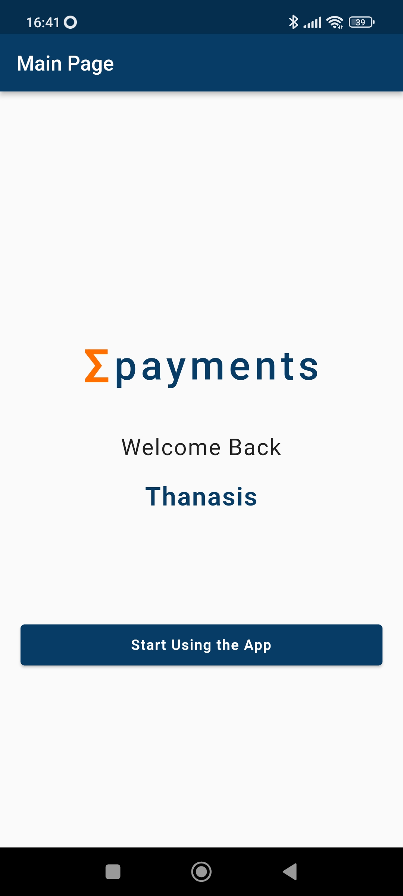
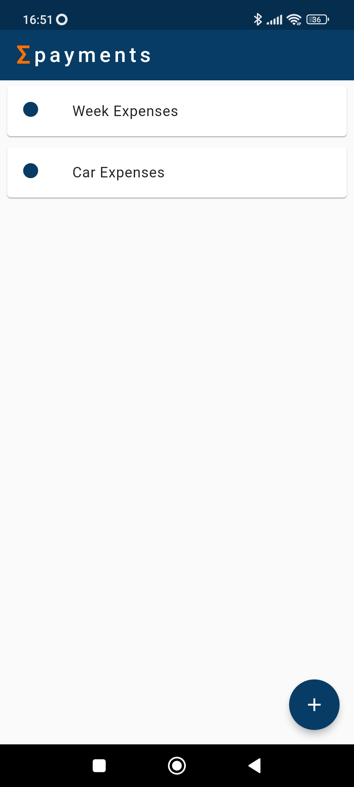
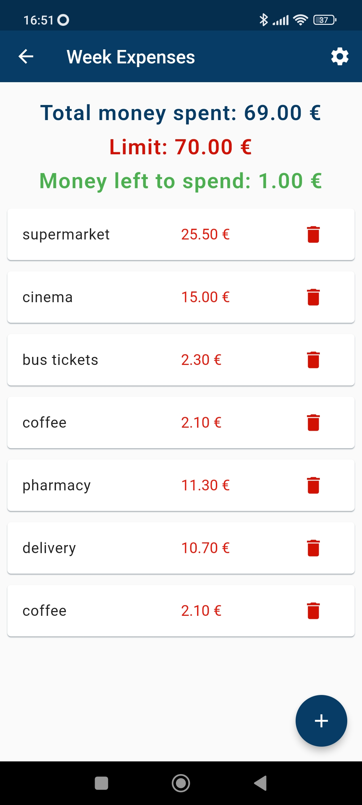
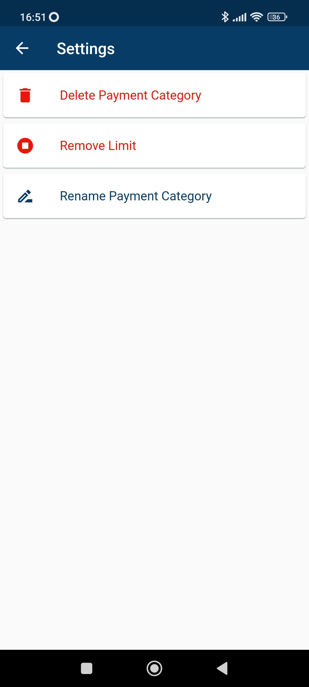

# Σpayments
Σpayments is a mobile application which is used for the user **to store all his payments** in order to control his savings. Σpayments uses **flutter** that is an open source framework by Google for building natively compiled, multi-platform applications from a single codebase. For the **backend** I use **Hive** that is the lightweight, **NoSql**, key-value database that is used to store the data **locally**.
The user has the opportunity to create **payment categories** and store inside them **payments**. For example a user can create a user can create a category: **Week Expenses** and store inside all the payments that the user's did for the whole week. Also a user can a limit to spend and  make sure he doesn't go over it.

## First Screen

## Main Screen (Payment Categories)
 

## Payments
 

## Settings Payments
 